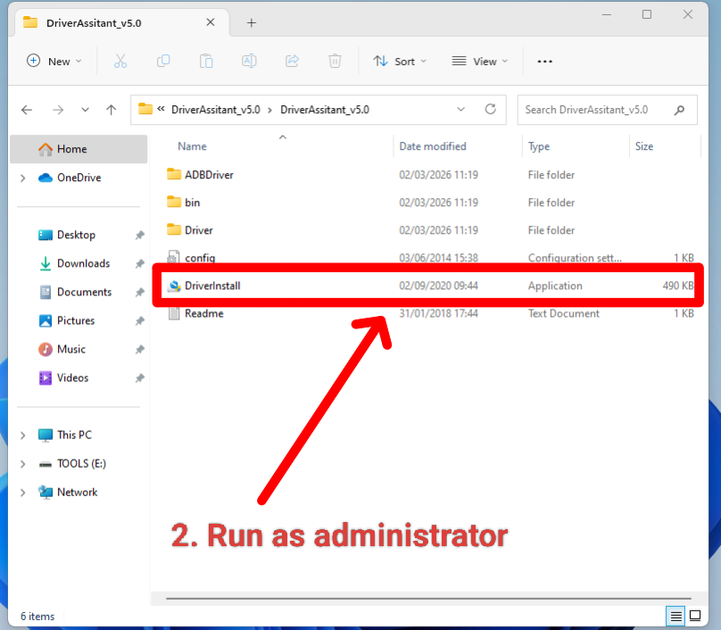
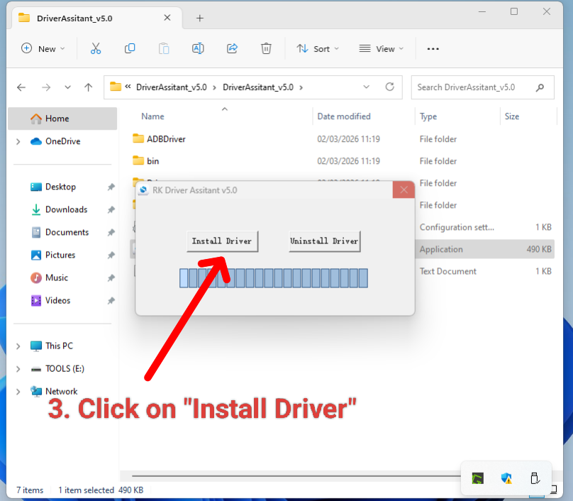
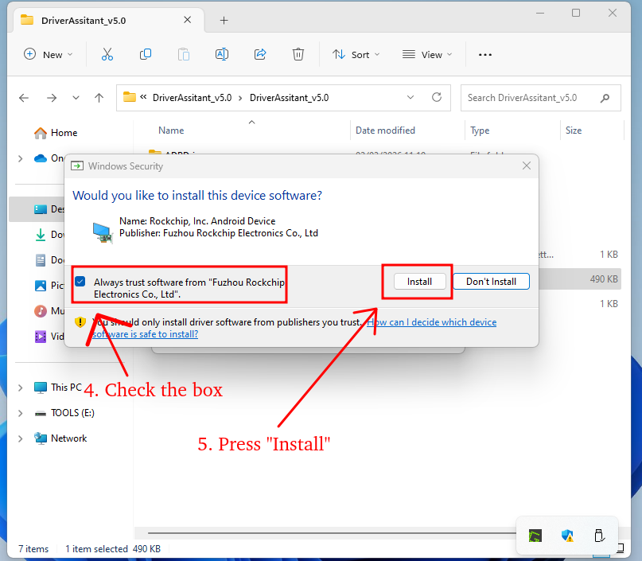
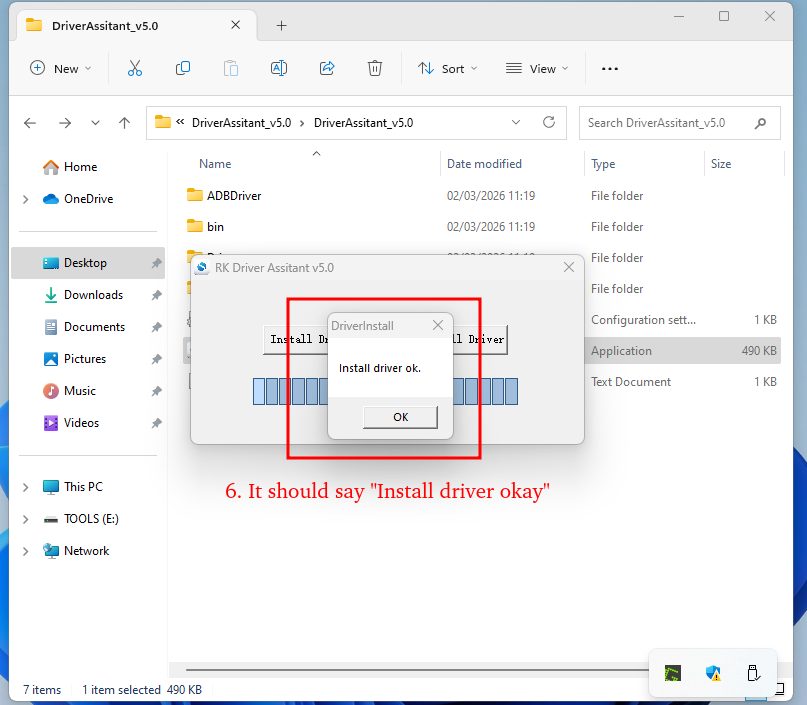
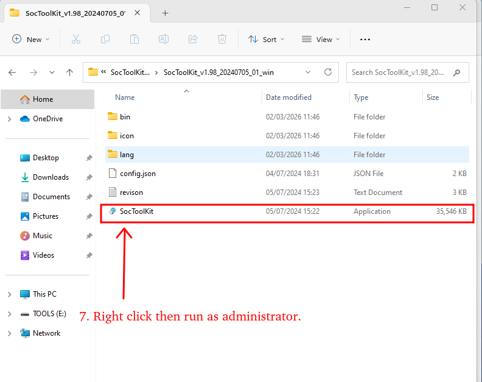
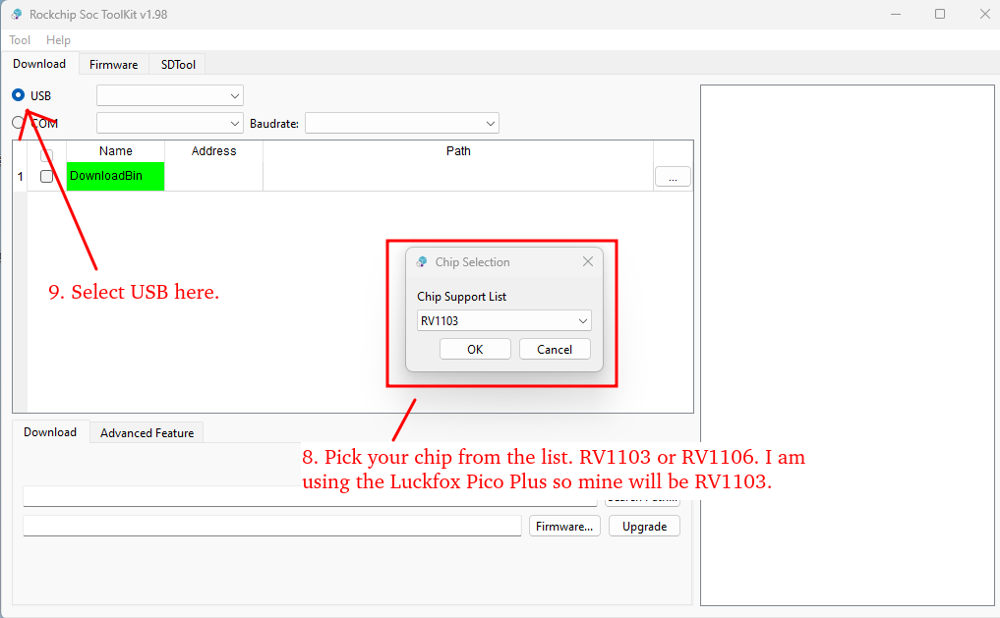
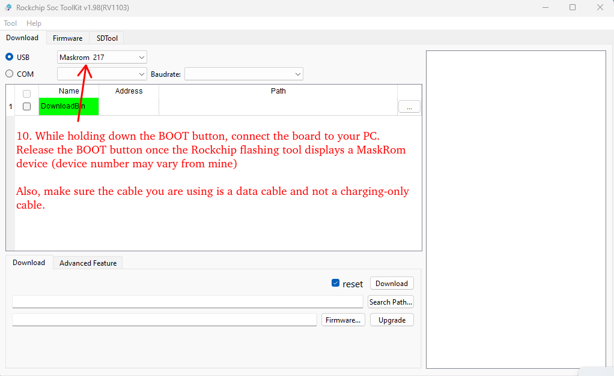
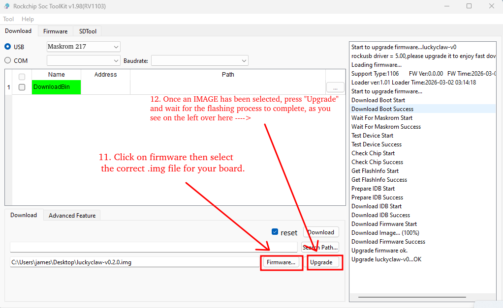

# LuckyClaw Flashing Guide (eMMC)

This guide covers flashing the LuckyClaw firmware to a Luckfox Pico board's eMMC storage using the Rockchip SOCToolKit on Windows.

> [!NOTE]
> We currently provide pre-built firmware images for the following board variants:
> - `luckyclaw-luckfox_pico_plus_rv1103-vX.X.X.img` — for **Luckfox Pico Plus**
> - `luckyclaw-luckfox_pico_pro_max_rv1106-vX.X.X.img` — for **Luckfox Pico Pro** or **Luckfox Pico Max**
>
> Download the image matching your board from the [Releases](https://github.com/jamesrossdev/luckyclaw/releases) page.

> [!IMPORTANT]
> Only the **Luckfox Pico Plus** (RV1103), **Luckfox Pico Pro** (RV1106), and **Luckfox Pico Max** (RV1106) are supported at this time.

> [!WARNING]
> Flashing replaces the entire filesystem on the board. All existing configuration, memories, sessions, and cron jobs will be lost. If you are upgrading from a previous version, back up your data first — see [Backup and Restore](BACKUP_RESTORE.md).

### Hardware

- **Luckfox Pico Plus** (RV1103), **Luckfox Pico Pro** (RV1106), or **Luckfox Pico Max** (RV1106) board
- USB Type-C to Type-A cable (must be **data capable**, not charge-only)
- A computer running Windows

### Software and Files

All files are bundled together on the [Releases](https://github.com/jamesrossdev/luckyclaw/releases) page:

1. **LuckyClaw firmware image** — pick the `.img` that matches your board:
   - `luckyclaw-luckfox_pico_plus_rv1103-vX.X.X.img` for **Luckfox Pico Plus**
   - `luckyclaw-luckfox_pico_pro_max_rv1106-vX.X.X.img` for **Luckfox Pico Pro** or **Luckfox Pico Max**

2. **Rockchip Driver Assistant** (`DriverAssistant_vX.X.zip`) — installs the USB driver so Windows can communicate with the board in MaskROM mode.

3. **Rockchip SOCToolKit** (`SocToolKit_vX.XX.zip`) — the flashing utility that writes the firmware image to the board.

---

## Step 1: Install the USB Driver

Before flashing, you must install the Rockchip USB driver on your Windows machine. You only need to do this **once per computer**.

1. Download and extract the **Driver Assistant** ZIP.
2. Open the extracted folder and **run `DriverInstall.exe` as Administrator**.



3. Click **Install Driver** in the dialog that appears.



4. Windows Security will ask you to trust software from "Fuzhou Rockchip Electronics". **Check the box** to always trust this publisher, then click **Install**.



5. Wait for the **"Install driver ok."** confirmation dialog, then click OK.



---

## Step 2: Open SOCToolKit

1. Download and extract the **SOCToolKit** ZIP.
2. Open the extracted folder, **right-click `SocToolKit.exe`**, and select **Run as administrator**.



3. When SOCToolKit opens, it will ask you to select a chip. Choose **RV1103** (for Luckfox Pico Plus) or **RV1106** (for Pico Pro or Pico Max) from the dropdown, then click **OK**. Make sure **USB** is selected (not COM).



---

## Step 3: Enter MaskROM Mode

The board must be in MaskROM mode before it can be flashed.

1. **Disconnect** the USB cable from the board if it is currently connected.
2. Locate the **BOOT button** on the board (near the USB-C port).
3. **Press and hold** the BOOT button.
4. While holding the BOOT button, plug the USB cable into the board and your computer.
5. Wait 2–3 seconds, then **release** the BOOT button.

If successful, SOCToolKit will display a **"Maskrom"** device in the USB dropdown at the top of the window. The device number may vary from the screenshot.

> [!TIP]
> Make sure the cable you are using is a **data cable** and not a charging-only cable. If no MaskROM device appears, try a different cable or USB port.



---

## Step 4: Select Firmware and Flash

1. Click the **Firmware…** button at the bottom of the window.
2. Browse to and select the `.img` file you downloaded (e.g. `luckyclaw-luckfox_pico_plus_rv1103-v0.2.0.img`).
3. Click **Upgrade** to begin flashing.
4. **Do not disconnect the cable** during this process. The log panel on the right will show progress.
5. When complete, the log will show **"Upgrade firmware ok."** and **"Upgrade luckyclaw-v0…OK"**.



The board will reboot automatically. If it does not, unplug and replug the USB cable (without holding the BOOT button).

---

## Step 5: First-Time Setup

After the board boots, connect to it via SSH and run the onboarding wizard:

```bash
ssh root@<DEVICE_IP>
luckyclaw onboard
```

The wizard will walk you through configuring your LLM provider, API key, Telegram/Discord bot tokens, and other settings. For full setup instructions, see the [README](../README.md).

### Restoring Previous Data

If you backed up your data before flashing, follow the [Backup and Restore](BACKUP_RESTORE.md) guide to restore your configuration and workspace.

---

## Troubleshooting

- **Device not detected in SOCToolKit:** Ensure you are using a data-capable USB cable. Try a different USB port. Make sure you held the BOOT button before and during cable insertion. Verify that Driver Assistant was installed successfully.
- **Flashing fails partway through:** Often caused by a loose USB connection or a faulty cable. Try a different cable.
- **"Test Device Fail" error:** The board may have exited MaskROM mode. Repeat the BOOT button sequence from Step 3.
- **Wrong chip selected:** If you selected RV1103 but have an RV1106 board (or vice versa), close SOCToolKit, reopen it, and select the correct chip.

## Further Reading

- [Official Luckfox burning instructions](https://wiki.luckfox.com/Luckfox-Pico/Luckfox-Pico-quick-start/image-burn)
- [Backup and Restore](BACKUP_RESTORE.md) — preserve your data before reflashing
- [LuckyClaw README](../README.md) — full project documentation
